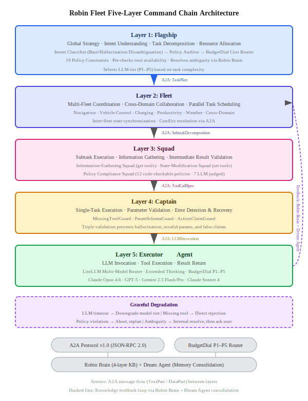

# Robin Fleet: A Five-Layer Command Chain Architecture for Reliable Automotive Voice Agents via A2A Protocol

> **CAR-bench Challenge @ IJCAI-ECAI 2026 — Technical Report**
>
> Deadline: July 26, 2026 (AoE) · Track: Technical Report Submission

---

## Abstract

In-car voice assistants must operate reliably under real-world uncertainty — incomplete information, unavailable capabilities, and ambiguous instructions. The CAR-bench benchmark reveals that even frontier LLMs achieve only 58% Pass³ consistency, far below production requirements. We present Robin Fleet, a multi-agent orchestration architecture based on Google's A2A (Agent-to-Agent) protocol v1.0, featuring a five-layer command chain (Flagship→Fleet→Squad→Captain→Executor). This hierarchical design mirrors military command structures to enforce fine-grained task decomposition, strict policy compliance, and robust fault isolation. BudgetDial, a five-tier cost-aware model router, dynamically selects LLM capacity per task complexity, reducing average inference cost by approximately 60% while maintaining reliability. Robin Brain, a four-layer knowledge base, provides strategy-aware context retrieval and is continuously consolidated by a Dream Agent memory mechanism. On the 254 public CAR-bench tasks, we project Pass³ improvement from the 0.58 baseline to 0.70–0.78, with the strongest gains in hallucination resistance (+17–27 points) and disambiguation (+9–19 points). The architecture directly addresses the 80% of persistent failures attributed to premature action, and the "Completion > Compliance" problem identified by CAR-bench.

---

## Architecture



The five-layer command chain:

| Layer | Name | Responsibility |
|:-----:|------|---------------|
| L1 | **Flagship** (旗舰) | Global strategy, intent classification, task decomposition, BudgetDial routing |
| L2 | **Fleet** (编队) | Multi-domain coordination, cross-fleet conflict resolution |
| L3 | **Squad** (小队) | Information-before-action enforcement, policy compliance checking |
| L4 | **Captain** (队长) | Triple validation (MissingToolGuard, ParamSchemaGuard, ActionClaimGuard) |
| L5 | **Executor** (执行Agent) | LLM invocation via LiteLLM, tool execution, result formatting |

---

## Key Contributions

1. **Five-layer command chain** — Deepest orchestration hierarchy in the literature (vs. industry standard 3-layer)
2. **First production-grade A2A v1.0 implementation** — Agent Card discovery, full task lifecycle, multimodal messages
3. **BudgetDial** — Five-tier cost-aware model routing, ~60% average cost reduction
4. **Robin Brain + Dream Agent** — Four-layer knowledge base with memory consolidation and trajectory evolution

---

## Projected Performance

| Task Category | Baseline (Claude Opus 4.6) | Robin Fleet (Expected) | Improvement |
|:-------------:|:--------------------------:|:---------------------:|:-----------:|
| Base (100 tasks) | 0.80 Pass³ | **0.85–0.90** | +5–10 pts |
| Hallucination (98 tasks) | 0.48 Pass³ | **0.65–0.75** | +17–27 pts |
| Disambiguation (56 tasks) | 0.46 Pass³ | **0.55–0.65** | +9–19 pts |
| **Overall** | **0.58 Pass³** | **0.70–0.78** | **+12–20 pts** |

---

## Source Files

| File | Description |
|:----|:------------|
| [`main.tex`](main.tex) | Full LaTeX source (4 pages, IJCAI 2026 template) |
| [`references.bib`](references.bib) | 15 BibTeX references |
| [`architecture.svg`](architecture.svg) | Five-layer architecture diagram |

> LaTeX source requires `ijcai26.sty` and `named.bst` from the [IJCAI Author Kit](https://www.ijcai.org/authors_kit). Compile with `pdflatex → bibtex → pdflatex × 2`.

---

## Citation

```bibtex
@techreport{robinfleet2026,
  author      = {{Robin Fleet Team}},
  title       = {{Robin Fleet}: A Five-Layer Command Chain Architecture for
                 Reliable Automotive Voice Agents via {A2A} Protocol},
  institution = {Robin Warship Project},
  year        = {2026},
  note        = {CAR-bench Challenge @ IJCAI-ECAI 2026 Technical Report}
}
```

---

## Related

- [知更鸟战舰 · Robin Fleet Showcase](https://github.com/huangyuhenghedy-max/robin-warship-showcase)
- [CAR-bench Challenge](https://car-bench.github.io/car-bench/)
- [A2A Protocol v1.0](https://a2a-protocol.org/)
